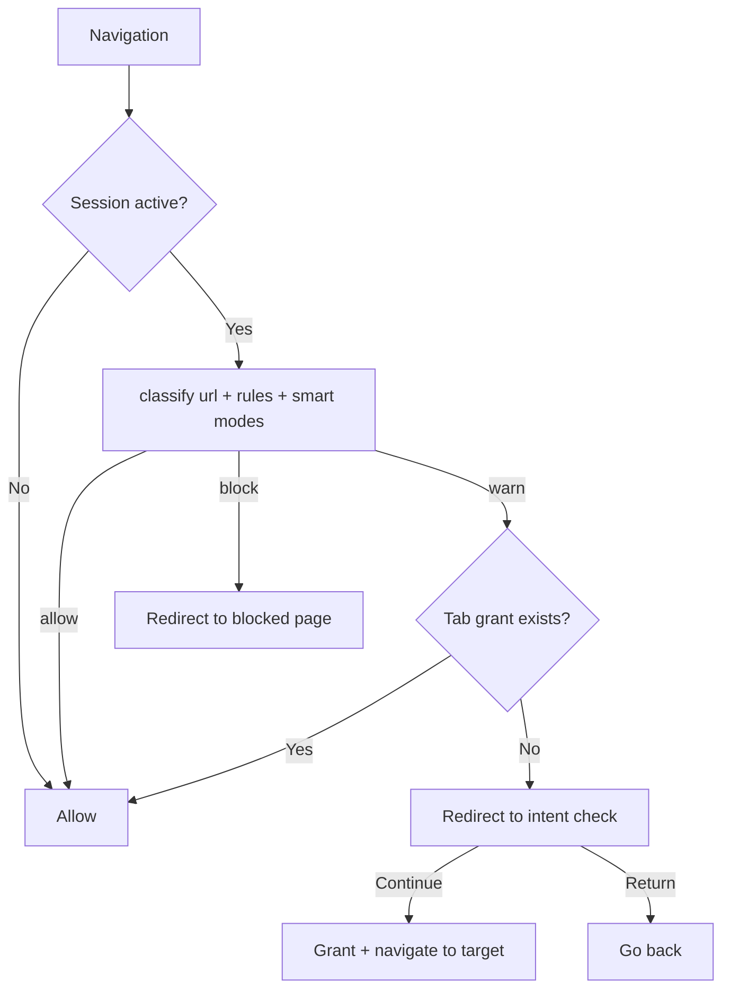

<div align="center">

**Language / 语言:** **English** · [简体中文](README.zh-CN.md)

# 🔦 Beacon

**Stay on course. Work with intention.**

**Beacon** is an open-source **TypeScript + React Chrome extension (Manifest V3)** for focus sessions, website blocking, Smart YouTube/Reddit modes, and local-first productivity analytics — guiding intentional browsing rather than gatekeeping the web.

[](LICENSE)
[](https://developer.chrome.com/docs/extensions/develop/migrate/what-is-mv3)
[](package.json)
[](https://react.dev/)
[](https://www.typescriptlang.org/)
[](https://vitejs.dev/)
[](https://tailwindcss.com/)

[Screenshots](#-screenshots) · [Features](#-features) · [Getting Started](#-getting-started) · [How It Works](#-how-it-works) · [Docs](#-documentation) · [Privacy](#-privacy)

</div>

> *The internet is not the enemy. Losing sight of your purpose is.*

---

## 📸 Screenshots

<table>
  <tr>
    <td width="50%" align="center">
      <strong>Start a focus session</strong><br/>
      <sub>Set a goal, pick a type & duration, and go.</sub><br/><br/>
      
    </td>
    <td width="50%" align="center">
      <strong>Website rules & Smart Modes</strong><br/>
      <sub>Block, warn, or allow sites — taming rabbit holes on YouTube & Reddit.</sub><br/><br/>
      
    </td>
  </tr>
</table>

---

## ✨ What is Beacon?

Beacon promotes **intentional browsing**. Instead of aggressively blocking sites, it:

- 🎯 Keeps you aligned with a stated focus goal during each session
- 🧭 Guides you back when you drift — without treating the web as the enemy
- 📊 Shows where your attention actually goes
- 🕳️ Tames rabbit holes on sites like YouTube and Reddit while keeping useful pages open

Everything runs **locally in your browser** — no account, no cloud, no tracking.

---

## 🚀 Features

### Focus & sessions

| | |
|---|---|
| 🎯 **Focus sessions** | Set a goal, session type, and duration |
| ⏱️ **Flexible timers** | 25 / 50 / 60 / 90 / 120 min presets, custom durations, and **Pomodoro** mode |
| 📋 **Profile presets** | Built-in presets (General, Student, Developer, …) plus **custom presets** (icon, title, site lists) |

### Website rules & smart modes

| | |
|---|---|
| ⛔ **Blocked** | Hard stop during a focus session |
| ⚠️ **Warning** | Gentle check-in before you continue |
| ✅ **Allowed** | Always open, no interruption |
| ▶️ **Smart YouTube** | Allow `/watch` & search · warn on Shorts, feed & trending |
| 🔴 **Smart Reddit** | Allow subreddits & search · warn on the popular feed |
| 💭 **Intent check** | *"What are you here for?"* before continuing to a warning site |

### Insights & nudges

| | |
|---|---|
| 🔔 **Gentle interventions** | Drift nudges for excessive tab switching and repeat distractions |
| 📈 **Analytics dashboard** | Focus time, sessions, distraction events, focus ratio, and site breakdown |
| 📅 **Reports** | Daily, weekly, and monthly summaries with a focus-by-day chart |
| 📤 **Data export** | Export everything to JSON or CSV anytime |

---

## 🛠 Tech stack

| Layer | Tools |
|---|---|
| **UI** | React 18 · TypeScript · Tailwind CSS |
| **Build** | Vite · [`@crxjs/vite-plugin`](https://crxjs.dev/) (Manifest V3) |
| **Chrome APIs** | `storage` · `tabs` · `webNavigation` · `alarms` · `notifications` |
| **Storage** | `chrome.storage.local` (durable) · `chrome.storage.session` (transient) |

---

## 📦 Getting started

### Prerequisites

- [Node.js](https://nodejs.org/) 18+
- Google Chrome (or Chromium-based browser)

### Install & build

```bash
git clone https://github.com/jasonwong1025/beacon.git
cd beacon
npm install
npm run build    # outputs the loadable extension to ./dist
```

### Load in Chrome

1. Open **`chrome://extensions`**
2. Enable **Developer mode** (top-right toggle)
3. Click **Load unpacked** → select the **`dist/`** folder
4. Pin Beacon to the toolbar and start your first session 🎉

### Develop with hot reload

```bash
npm run dev
```

Load `dist/` as an unpacked extension — CRXJS keeps it in sync as you edit.

### Scripts

| Command | Description |
|---|---|
| `npm run dev` | Dev server with hot reload |
| `npm run build` | Typecheck + production build |
| `npm run typecheck` | Run `tsc --noEmit` |
| `node scripts/gen-icons.mjs` | Regenerate extension icon PNGs |

---

## ⚙️ How it works

When a focus session is **active**, the service worker intercepts main-frame navigations and classifies each URL against your rules and smart modes:



| Verdict | What happens |
|---|---|
| **Allow** | Nothing — browse as usual |
| **Block** | Tab redirects to a calm *"stay on course"* page |
| **Warn** | Tab redirects to an intent check; **Continue** grants access for that tab + domain for the rest of the session, **Return** sends you back |

In the background, Beacon tracks **time-on-domain** per active tab and **tab-switch frequency** to power analytics and drift nudges. Timers and Pomodoro phase transitions run on `chrome.alarms` so they survive service worker suspension.

→ Full details in [`docs/architecture.md`](docs/architecture.md)

---

## 📁 Project structure

```
beacon/
├── manifest.config.ts          # MV3 manifest (typed)
├── vite.config.ts
├── scripts/gen-icons.mjs       # Dependency-free PNG icon generator
├── public/icons/               # Generated extension icons
├── src/
│   ├── background/             # Service worker — guard, tracker, session controller
│   ├── popup/                  # Toolbar popup (start / stop a session)
│   ├── dashboard/              # Options page — overview, rules, reports, settings
│   ├── pages/                  # Blocked + warn / intent-check pages
│   ├── modules/                # Framework-agnostic logic
│   │   ├── session-engine/     #   Session lifecycle, timers, Pomodoro
│   │   ├── website-rules/      #   URL classification + smart modes
│   │   ├── analytics/          #   Aggregation, reports, distraction detection, export
│   │   ├── storage/            #   Typed chrome.storage wrapper
│   │   ├── types.ts            #   Shared domain types + defaults
│   │   └── messaging.ts        #   UI ↔ service-worker message contract
│   ├── ui/                     # Shared React hooks + components
│   └── styles/
└── docs/
```

> The original product spec proposes an `apps/` + `packages/` monorepo. This MVP ships as a single package with the same logical module boundaries under `src/modules/`, so it can be split into workspace packages later without rewrites.

---

## 📚 Documentation

| Doc | Description |
|---|---|
| [**docs site (GitHub Pages)**](https://jasonwong1025.github.io/beacon/) | Searchable project hub — enable via **Settings → Pages → `/docs`** |
| [`docs/user-guide.md`](docs/user-guide.md) | End-user walkthrough — sessions, rules, reports |
| [`docs/architecture.md`](docs/architecture.md) | Data model, service worker, navigation flow |
| [`docs/roadmap.md`](docs/roadmap.md) | v1.0 shipped · v1.5 in progress · v2.0 planned |

### Suggested GitHub repository topics

Add these under **Repository → About → Topics** for discoverability:

`chrome-extension` `manifest-v3` `typescript` `react` `tailwindcss` `vite` `productivity` `focus` `website-blocker` `pomodoro` `crxjs`

---

## 🔒 Privacy

Beacon is **local-first**:

- ✅ No account required
- ✅ No cloud sync or third-party analytics
- ✅ All session, event, and rule data stays in your browser
- ✅ Export or wipe your data anytime from **Settings → Your Data**

---

## 📄 License

[MIT](LICENSE) © Beacon contributors
