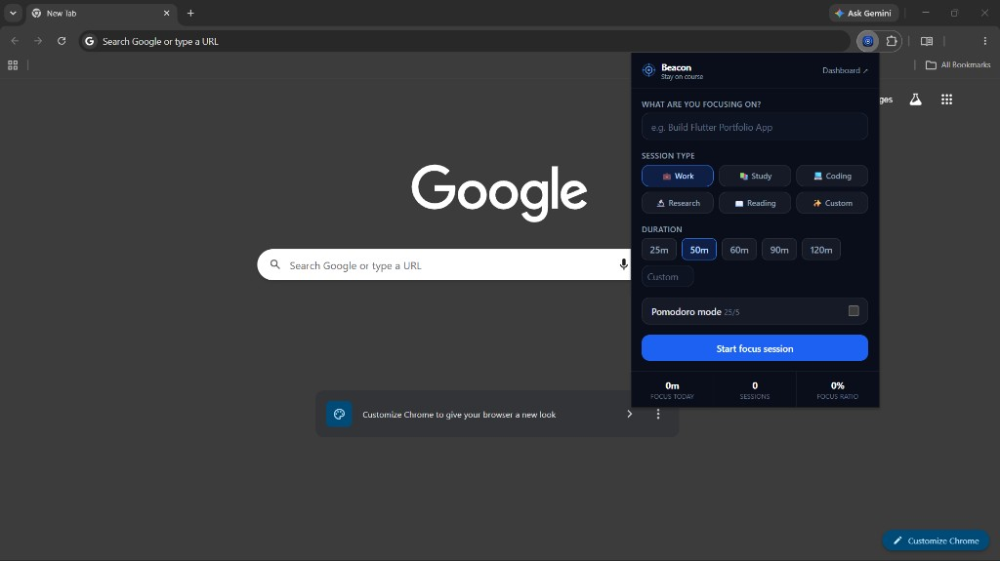
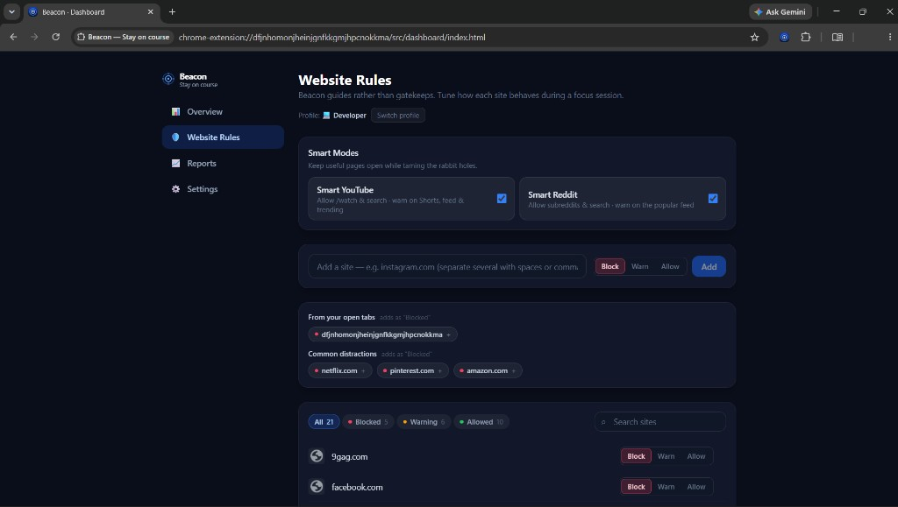
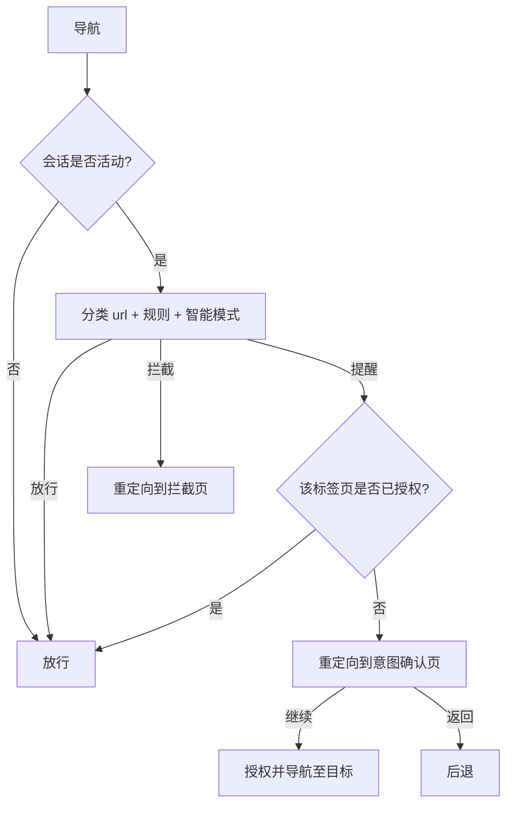

<div align="center">

**Language / 语言:** [English](README.md) · **简体中文**

# 🔦 Beacon

**保持专注，有意而为。**

**Beacon** 是一款开源的 **TypeScript + React Chrome 扩展（Manifest V3）**，提供专注会话、网站拦截、智能 YouTube/Reddit 模式与本地生产力统计——引导你有意浏览，而非粗暴封锁网络。

[](LICENSE)
[](https://developer.chrome.com/docs/extensions/develop/migrate/what-is-mv3)
[](package.json)
[](https://react.dev/)
[](https://www.typescriptlang.org/)
[](https://vitejs.dev/)
[](https://tailwindcss.com/)

[截图](#-截图) · [功能](#-功能) · [快速开始](#-快速开始) · [工作原理](#-工作原理) · [文档](#-文档) · [隐私](#-隐私)

</div>

> *互联网不是敌人，迷失初衷才是。*

---

## 📸 截图

<table>
  <tr>
    <td width="50%" align="center">
      <strong>开始专注会话</strong><br/>
      <sub>设定目标、选择配置与时长，即可开始。</sub><br/><br/>
      
    </td>
    <td width="50%" align="center">
      <strong>网站规则与智能模式</strong><br/>
      <sub>拦截、提醒或放行网站 — 驯服 YouTube 与 Reddit 的「兔子洞」。</sub><br/><br/>
      
    </td>
  </tr>
</table>

---

## ✨ Beacon 是什么？

Beacon 倡导 **有意浏览**。它不会粗暴地封锁网站，而是：

- 🎯 在每次会话中让你始终对齐所设定的专注目标
- 🧭 在你分心时温和引导回归 — 不把网络当作敌人
- 📊 展示你的注意力实际花在了哪里
- 🕳️ 在 YouTube、Reddit 等站点上驯服兔子洞，同时保留有用页面

一切 **仅在浏览器本地运行** — 无需账号、无需云端、无追踪。

---

## 🚀 功能

### 专注与会话

| | |
|---|---|
| 🎯 **专注会话** | 设定目标、选择配置预设与时长 |
| ⏱️ **灵活计时** | 25 / 50 / 60 / 90 / 120 分钟预设、自定义时长，以及 **番茄钟** 模式 |
| 📋 **配置预设** | 内置通用/学生/开发者等预设，并支持 **自定义预设**（图标、名称、站点列表） |

### 网站规则与智能模式

| | |
|---|---|
| ⛔ **拦截** | 专注会话期间硬性阻止访问 |
| ⚠️ **提醒** | 继续访问前温和确认 |
| ✅ **放行** | 始终可访问，不打断 |
| ▶️ **智能 YouTube** | 放行 `/watch` 与搜索 · 对 Shorts、首页与 trending 提醒 |
| 🔴 **智能 Reddit** | 放行子版块与搜索 · 对热门信息流提醒 |
| 💭 **意图确认** | 访问提醒类网站前询问 *「你来这里做什么？」* |

### 洞察与轻提醒

| | |
|---|---|
| 🔔 **温和干预** | 针对频繁切换标签与重复分心发出漂移提醒 |
| 📈 **分析仪表盘** | 专注时长、会话数、分心事件、专注比例与网站分布 |
| 📅 **报告** | 每日、每周、每月摘要及按日专注图表 |
| 📤 **数据导出** | 随时导出为 JSON 或 CSV |

---

## 🛠 技术栈

| 层级 | 工具 |
|---|---|
| **UI** | React 18 · TypeScript · Tailwind CSS |
| **构建** | Vite · [`@crxjs/vite-plugin`](https://crxjs.dev/)（Manifest V3） |
| **Chrome API** | `storage` · `tabs` · `webNavigation` · `alarms` · `notifications` |
| **存储** | `chrome.storage.local`（持久） · `chrome.storage.session`（临时） |

---

## 📦 快速开始

### 环境要求

- [Node.js](https://nodejs.org/) 18+
- Google Chrome（或基于 Chromium 的浏览器）

### 安装与构建

```bash
git clone https://github.com/jasonwong1025/beacon.git
cd beacon
npm install
npm run build    # 在 ./dist 生成可加载的扩展
```

### 在 Chrome 中加载

1. 打开 **`chrome://extensions`**
2. 开启右上角 **开发者模式**
3. 点击 **加载已解压的扩展程序** → 选择 **`dist/`** 文件夹
4. 将 Beacon 固定到工具栏，开始你的第一次专注会话 🎉

### 热重载开发

```bash
npm run dev
```

将 `dist/` 作为已解压扩展加载 — CRXJS 会在你编辑时保持同步。

### 脚本

| 命令 | 说明 |
|---|---|
| `npm run dev` | 开发服务器（热重载） |
| `npm run build` | 类型检查 + 生产构建 |
| `npm run typecheck` | 运行 `tsc --noEmit` |
| `node scripts/gen-icons.mjs` | 重新生成扩展图标 PNG |

---

## ⚙️ 工作原理

当专注会话 **处于活动状态** 时，Service Worker 会拦截主框架导航，并根据你的规则与智能模式对 URL 进行分类：



| 判定 | 行为 |
|---|---|
| **放行** | 无操作 — 正常浏览 |
| **拦截** | 标签页重定向至平静的 *「保持专注」* 页面 |
| **提醒** | 标签页重定向至意图确认；**继续** 可为该标签页 + 域名授权至会话结束，**返回** 则后退 |

后台会追踪每个活动标签的 **域名停留时间** 与 **标签切换频率**，用于分析与漂移提醒。计时器与番茄钟阶段切换通过 `chrome.alarms` 运行，可在 Service Worker 挂起后恢复。

→ 完整说明见 [`docs/architecture.md`](docs/architecture.md)（英文）

---

## 📁 项目结构

```
beacon/
├── manifest.config.ts          # MV3 清单（TypeScript）
├── vite.config.ts
├── scripts/gen-icons.mjs       # 无依赖 PNG 图标生成器
├── public/icons/               # 生成的扩展图标
├── src/
│   ├── background/             # Service Worker — 守卫、追踪、会话控制
│   ├── popup/                  # 工具栏弹窗（开始/结束会话）
│   ├── dashboard/              # 选项页 — 概览、规则、报告、设置
│   ├── pages/                  # 拦截页 + 提醒/意图确认页
│   ├── modules/                # 与框架无关的逻辑
│   │   ├── session-engine/     #   会话生命周期、计时、番茄钟
│   │   ├── website-rules/      #   URL 分类 + 智能模式
│   │   ├── analytics/          #   聚合、报告、分心检测、导出
│   │   ├── storage/            #   类型化的 chrome.storage 封装
│   │   ├── types.ts            #   共享领域类型与默认值
│   │   └── messaging.ts        #   UI ↔ Service Worker 消息契约
│   ├── ui/                     # 共享 React 钩子与组件
│   └── styles/
└── docs/
```

> 原始产品规格建议采用 `apps/` + `packages/` 单体仓库。本 MVP 以单包形式发布，在 `src/modules/` 下保持相同逻辑模块边界，便于日后拆分为 workspace 包而无需重写。

---

## 📚 文档

| 文档 | 说明 |
|---|---|
| [**文档站点（GitHub Pages）**](https://jasonwong1025.github.io/beacon/) | 可搜索的项目主页 — 在 **Settings → Pages → `/docs`** 启用 |
| [`docs/user-guide.md`](docs/user-guide.md) | 用户指南 — 会话、规则、报告（英文） |
| [`docs/architecture.md`](docs/architecture.md) | 数据模型、Service Worker、导航流程（英文） |
| [`docs/roadmap.md`](docs/roadmap.md) | v1.0 已发布 · v1.5 进行中 · v2.0 规划中（英文） |

### 建议的 GitHub 仓库标签

在 **Repository → About → Topics** 中添加：

`chrome-extension` `manifest-v3` `typescript` `react` `tailwindcss` `vite` `productivity` `focus` `website-blocker` `pomodoro` `crxjs`

---

## 🔒 隐私

Beacon 采用 **本地优先** 设计：

- ✅ 无需注册账号
- ✅ 无云端同步或第三方分析
- ✅ 所有会话、事件与规则数据均保留在浏览器中
- ✅ 可在 **设置 → 你的数据** 中随时导出或清除

---

## 📄 许可证

[MIT](LICENSE) © Beacon contributors
